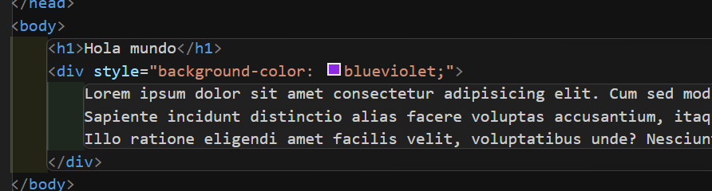
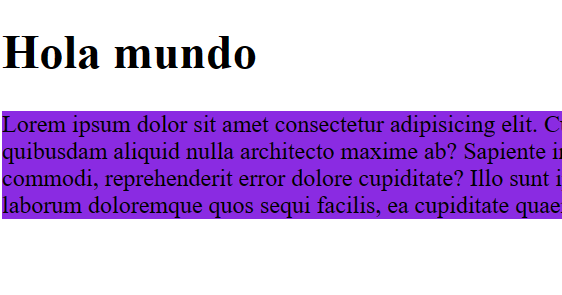
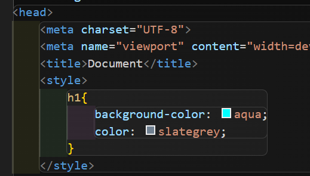
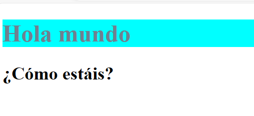
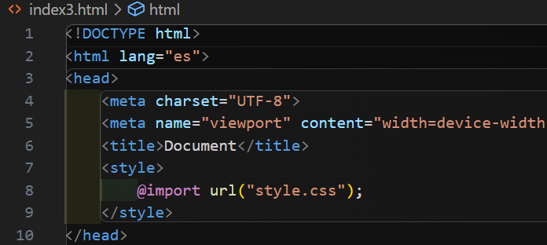
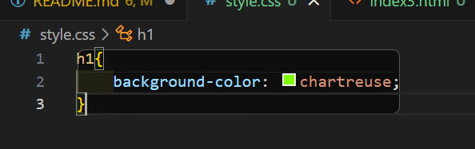
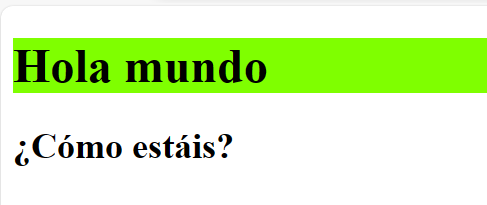
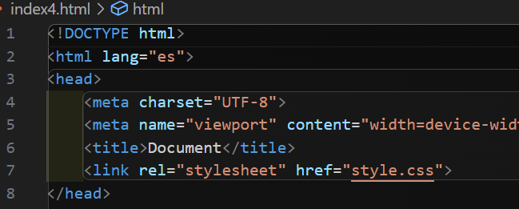
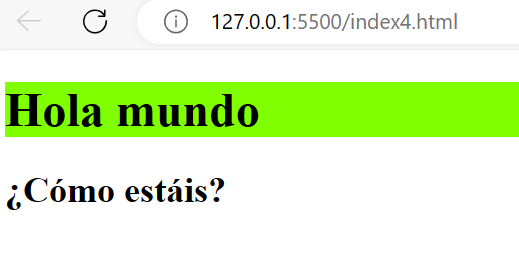

# Ejercicios de como asociar un documento CSS en un HTML

A partir de la estructura básica de un HTML y realizando todas las llamadas a las
distintas formas de llamar a un CSS desde el mismo documento de HTML realiza
lo siguiente:

□ Manera 1: Define un estilo en línea que modifique alguna propiedad de CSS de dicho
elemento mediante a 

👉Como vemos en la imagen, hacemos que todo lo que haya dentro de "div" se ponga de color.
>

👉Aquí vemos el resultado.
>

□ Manera 2: Define una etiqueta  dentro del head del documento que
modifique alguna propiedad de algún elemento de CSS mediante a un selector.
👉Como vemos en la imagen, hacemos que todo lo que sea h1 se ponga de color tanto texto como fondo.
>

👉Aquí vemos el resultado.
>

□ Manera 3: Dentro de la etiqueta  definida anteriormente, haz una
llamada a un fichero externo de CSS mediante a @import url.
👉Como vemos en la imagen, hacemos que todo lo que sea h1 se ponga de color.
>
>

👉Aquí vemos el resultado.
>

□ Manera 4: Mediante a la etiqueta <link rel="stylesheet" href="./style.css">
realiza la llamada a un fichero externo de CSS.
👉Como vemos en la imagen, hacemos que todo lo que sea h1 se ponga de color mediante link y con el mismo fichero css que en el anterior.
>

👉Aquí vemos el resultado.
>